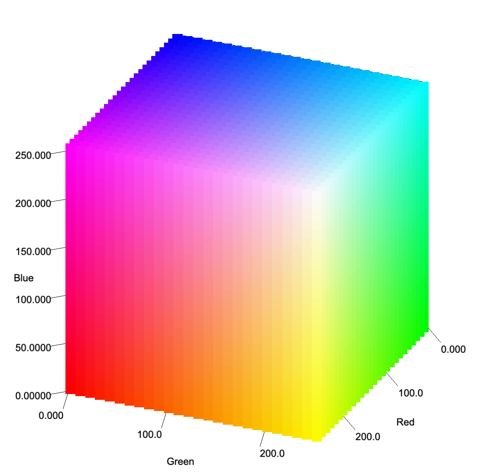

# **Chromatic3D**  

## Overview  
**Chromatic3D** is a **Java-based** 3D visualization application designed to represent **RGB color spaces**. Originally developed to assist in **high school chemical experiments**, this project provides an intuitive way to visualize and interpret color data. It utilizes the **Jzy3d** library for generating and manipulating 3D charts and objects.  

---  

## Features  
- **3D RGB Cube Visualization** – Display RGB color spaces in a three-dimensional cube.  
- **Experiment Set Management** – Add and manage multiple experiment sets with distinct colors and points.  
- **Customizable Display** – Enable or disable elements such as background, equations, and gravity points.  
- **Detailed Data Analysis** – Generate reports containing polygon area calculations, distance from the origin, and brightness percentages.  

---  

## About the Experiment  
This experiment consists of multiple test sets, each corresponding to a different concentration of **butterfly pea flower extract** (e.g., **0.5g, 1.5g, ...**).  

For each concentration, the solution is tested under **three different pH conditions**, and the resulting colors are recorded. These colors are then plotted in the **RGB coordinate system**, forming a plane with three points.  

After collecting data from all sets, the **angles between the planes** are analyzed:  
- If the planes for different concentrations are **nearly parallel**, it suggests that **the color change follows a linear amplification** as concentration increases.  
- If the angles between planes are **large (close to perpendicular)**, it indicates that **higher concentrations result in significantly different color properties**, meaning the relationship is **non-linear**.  

If a **linear trend** is observed, further analysis will focus on **the distance between each plane and the origin (O)**:  
- A **greater distance** from the origin suggests a **brighter** and **lighter** color.  
- A **shorter distance** from the origin suggests a **darker** and **more concentrated** color.  

By examining this trend across multiple concentrations, we aim to determine whether the **relationship between color intensity and concentration is predictable and consistent**.  

---  

## Project Structure  
```
Chromatic3D/
├─ README.md
├─ pictures
│  ├─ a.png
│  └─ b.png
├─ pom.xml
├─ src
│  └─ main
│     ├─ java
│     │  └─ com
│     │     └─ njdge
│     │        └─ chromatic3d
│     │           ├─ CoordDemo.java
│     │           ├─ Utils.java
│     │           ├─ object
│     │           │  ├─ EnvironmentManager.java
│     │           │  └─ impl
│     │           │     └─ ExperimentSet.java
│     │           └─ spaces
│     │              └─ RGBCubeDemo.java
│     └─ resources
│        ├─ META-INF
│        │  └─ maven
│        │     └─ archetype.xml
│        └─ archetype-resources
│           ├─ pom.xml
│           └─ src
│              ├─ main
│              │  └─ java
│              │     └─ App.java
│              └─ test
│                 └─ java
│                    └─ AppTest.java
└─ target
   └─ classes
      ├─ META-INF
      │  └─ maven
      │     └─ archetype.xml
      ├─ archetype-resources
      │  ├─ pom.xml
      │  └─ src
      │     ├─ main
      │     │  └─ java
      │     │     └─ App.java
      │     └─ test
      │        └─ java
      │           └─ AppTest.java
      └─ com
         └─ njdge
            └─ chromatic3d
               ├─ CoordDemo.class
               ├─ Utils.class
               ├─ object
               │  ├─ EnvironmentManager.class
               │  └─ impl
               │     └─ ExperimentSet.class
               └─ spaces
                  └─ RGBCubeDemo.class
```  

---  

## Dependencies  
- **[Jzy3d](http://www.jzy3d.org/)** – A Java library for 3D plotting.  

---  

## Preview  

### Mapping of Real Data  
  

### RGB Cube Demo  
  

