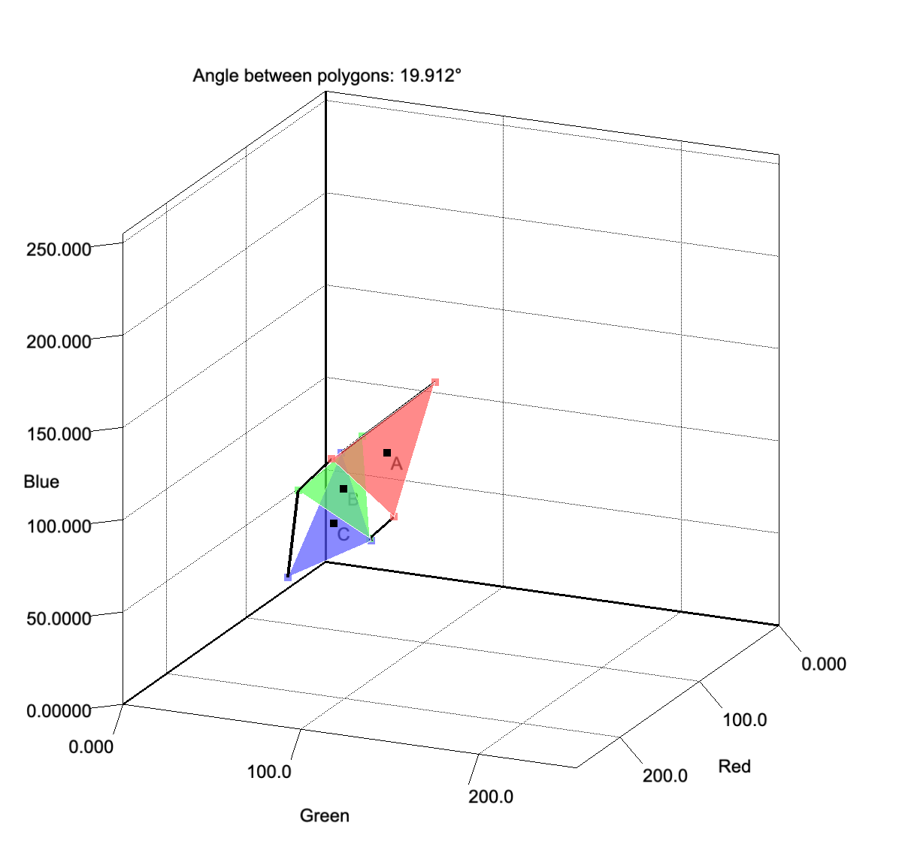

# **Chromatic3D**  

## Overview  
**Chromatic3D** is a **Java-based** 3D visualization application designed to represent **RGB color spaces**. Originally developed to assist in **high school chemical experiments**, this project provides an intuitive way to visualize and interpret color data. It utilizes the **Jzy3d** library for generating and manipulating 3D charts and objects.  

---  

## Features  
- **3D RGB Cube Visualization** – Display RGB color spaces in a three-dimensional cube.  
- **Experiment Set Management** – Add and manage multiple experiment sets with distinct colors and points.  
- **Customizable Display** – Enable or disable elements such as background, equations, and gravity points.  
- **Detailed Data Analysis** – Generate reports containing polygon area calculations, distance from the origin, and brightness percentages.  

---  

## Project Structure  
```
src/main/java/com/njdge/chromatic3d       # Main application logic  
src/main/java/com/njdge/chromatic3d/object # Experiment data and environment management  
src/main/java/com/njdge/chromatic3d/spaces # RGB space visualization demos  
```  

---  

## Dependencies  
- **[Jzy3d](http://www.jzy3d.org/)** – A Java library for 3D plotting.  

---  

## Preview  

### Mapping of Real Data  
  

### RGB Cube Demo  
  
